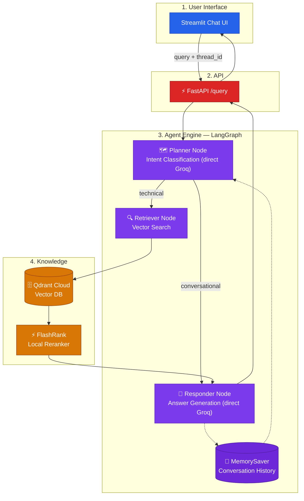

# Architecture — Built Up Stage by Stage

This diagram grows one subgraph at a time as each lesson is introduced.

## Stage 3 — Reranking + Memory

Two additions on top of Stage 2: the Retriever now routes through
**FlashRank** before reaching the Responder, and the graph carries a
**MemorySaver** checkpoint keyed by `thread_id`. Still no LLM gateway, still
no guardrails.

The next stage (`stage-4-guardrails`) adds a Safety Gate subgraph in front
of the Agent Engine.
