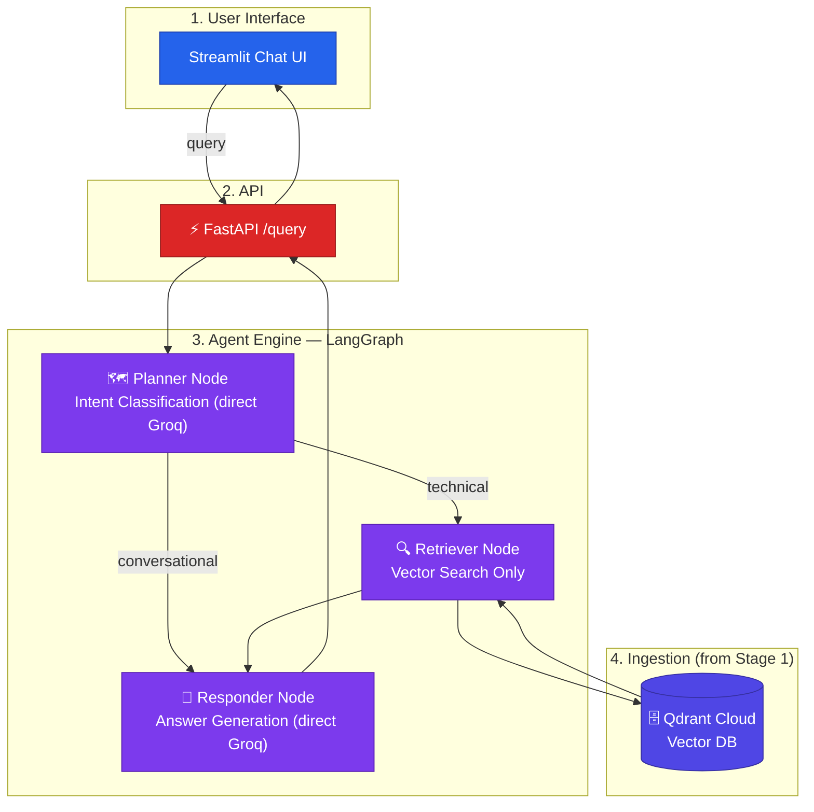

# Architecture — Built Up Stage by Stage

This diagram grows one subgraph at a time as each lesson is introduced.

## Stage 2 — Basic RAG (no reranking, no memory)

No reranking, no memory, no guardrails, no LLM gateway yet — the Planner
and Responder nodes call Groq directly. Compare this diagram to Stage 1's:
the Ingestion subgraph didn't change, we just added a way to query it.

The next stage (`stage-3-rerank-memory`) adds a FlashRank reranker between
Retriever and Responder, and a MemorySaver checkpoint on the graph.
