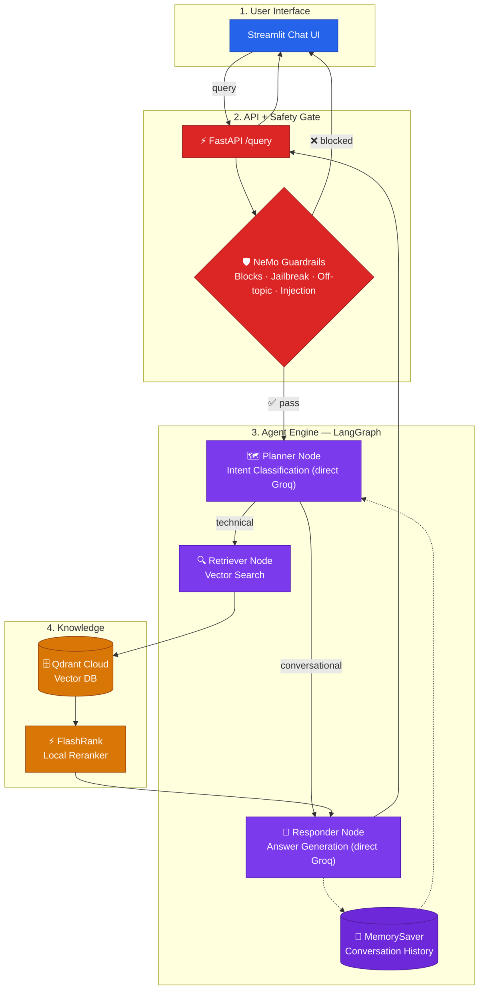

# Architecture — Built Up Stage by Stage

This diagram grows one subgraph at a time as each lesson is introduced.

## Stage 4 — Guardrails

The Guardrails gate sits in `main.py`, not inside the LangGraph — it's a
pre-graph HTTP-layer check on the raw user message, called once before
`rag_agent.invoke(...)`. It is input-only: the final LLM answer is never
re-checked.

The next stage (`stage-5-llm-gateway`) adds an LLM Gateway subgraph that
the Planner and Responder route through — but not the guardrails
classifier, which intentionally stays on a direct Groq call.
