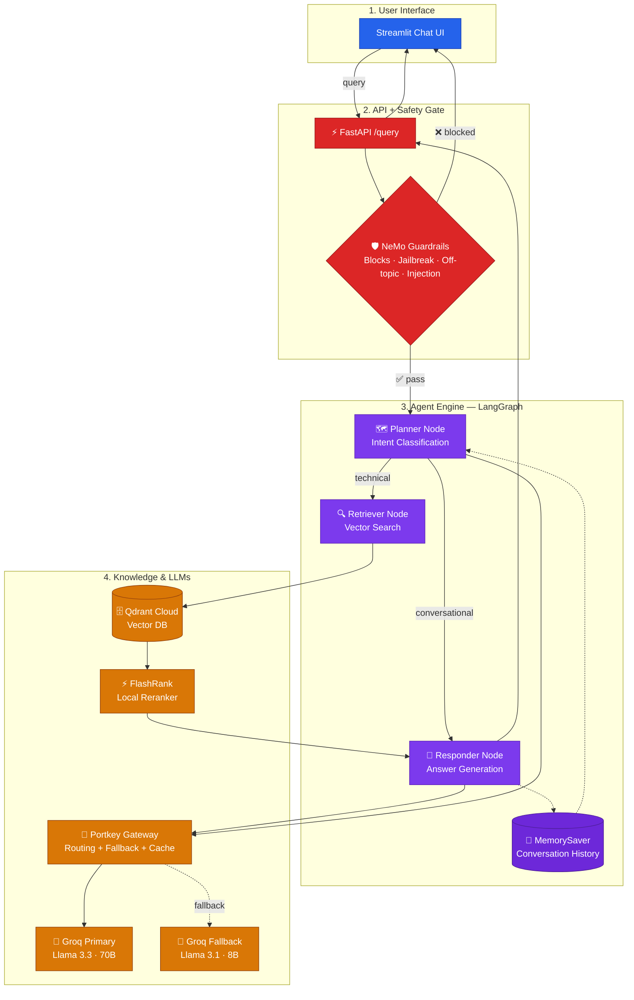

# Architecture — Built Up Stage by Stage

This diagram grows one subgraph at a time as each lesson is introduced.

## Stage 5 — LLM Gateway

This is the full agent-side architecture. `app/guardrails/rails.py`'s
classifier LLM is intentionally left off this Portkey path — it's the one
LLM call in the project that never moves onto the gateway.

The final stage (`stage-6-evals`) adds a RAGAS Evaluation Suite subgraph
that queries this whole system from the outside to measure it.
