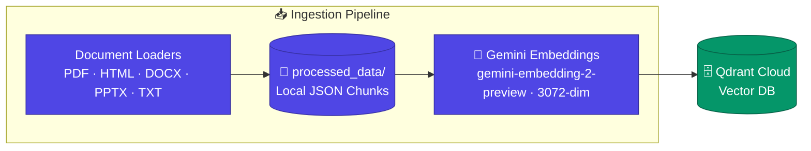

# Architecture — Built Up Stage by Stage

This diagram grows one subgraph at a time as each lesson is introduced.

## Stage 1 — Data Ingestion

`DATA/true_data/` is parsed by extension-specific loaders, chunked into
~1500-character paragraph-aware pieces, saved locally, embedded with
Gemini, and upserted into a Qdrant Cloud collection.

The next stage (`stage-2-basic-rag`) adds the Agent Engine and Interface
subgraphs that read from this vector store.
