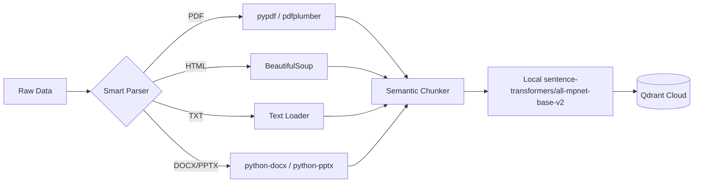

# 📥 Ingestion Engine: Data to Knowledge

The Ingestion Engine is a modular, high-performance pipeline designed to convert raw enterprise data into a searchable vector format.

## 🔄 The Pipeline Flow


---

## 🛠️ Technical Specifications

### 1. Smart Parsing (Local, No External OCR)
All document parsing runs entirely on-device — no external OCR service or cloud API is required:
*   **PDFs**: Parsed locally via **pypdf** (primary) and **pdfplumber** (fallback for complex layouts). Handles multi-page PDFs without any page-count limits.
*   **HTML**: Processed via **BeautifulSoup**. It intelligently strips out `<script>`, `<style>`, and metadata tags to extract only the readable content.
*   **Office Docs**: Supports `.docx` via `python-docx` and `.pptx` via `python-pptx`.
*   **Plain Text**: Loaded directly with a simple text reader.

### 2. Semantic Chunking
*   **Chunk Size**: `1500` characters.
*   **Overlap**: Natural overlap (we split by paragraph breaks `\n\n` rather than arbitrary character counts).
*   **Logic**: The system uses a semantic-ish, paragraph-aware splitter. It attempts to keep paragraphs together to maintain context, ensuring that no chunk is cut off mid-sentence whenever possible. This prevents the LLM from getting "hallucinated" fragments.

### 3. Vectorization & Storage
*   **Embedding Model**: `sentence-transformers/all-mpnet-base-v2`, loaded locally by `app/services/retrieval/embedding.py`.
*   **Vector Dimensions**: Resolved at runtime from the loaded model; the collection is created with that dimension.
*   **Vector Database**: **Qdrant**. We use a Cloud-hosted Qdrant instance for low-latency retrieval.
*   **Distance Metric**: **Cosine Similarity** (`models.Distance.COSINE`) is used to measure how closely a user query matches our document chunks.

---

## 🌍 Universal Ingestion Command
The engine is a manual batch job. It scans the supplied directory, detects subfolders, and maps folder names to metadata such as `true` and `noisy`. It does not watch `DATA/` for new files.

```powershell
# Command to run the full ingestion
python -m app.ingestion.processor DATA --wipe
```

Run the command again after adding or changing a document. Without `--wipe`, points are upserted with new UUIDs, so re-ingesting an unchanged file can create duplicate chunks.
