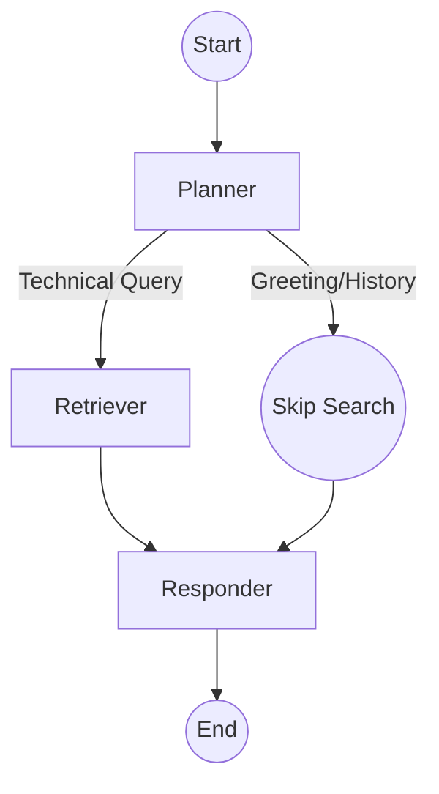

# 🧠 Node Intelligence: The Agentic Brain

The project uses a **Cyclic State Machine** powered by **LangGraph**. Unlike standard RAG, our agent doesn't just search; it *thinks* about whether a search is even necessary.

> This doc covers Stage 2's version of the nodes. Reranking, memory, and the LLM gateway all arrive in later stages and will be layered in here as they're introduced.

---

## 🤖 The Graph Nodes

### 1. 🧭 The Planner Node
*   **Model**: Groq (Llama 3.3 70B), called directly — no LLM gateway yet.
*   **Logic**: The Planner is the entry point. It analyzes the entire conversation history and the new user message.
*   **Decisions**:
    *   `CONVERSATIONAL`: If the user says "Hi" or asks about something already in the chat history, it skips the expensive search process.
    *   `TECHNICAL`: If the user asks a question about Kubernetes, Intel, or Networking, it generates a refined, optimized search query.

### 2. 🔍 The Retriever Node
*   **Services**: Qdrant Cloud (Vector Search) only — the FlashRank reranking stage arrives next lesson.
*   **Mechanics**:
    *   We convert the user query into a 3072-dimensional vector using Gemini's `gemini-embedding-2-preview`.
    *   We perform a **Cosine Similarity** search in Qdrant and take the top **5** candidates directly.
    *   *Why only 5, and no rerank yet?* Bi-encoder similarity search is extremely fast (sub-10ms) because it only compares pre-calculated vectors, but it lacks deep semantic understanding of the relationship between the query and the text. That gap is exactly what Stage 3's reranker fixes.

### 3. ✍️ The Responder Node
*   **Model**: Groq (Llama 3.3 70B), called directly.
*   **Logic**: This is the final synthesizer. It takes the retrieved documents (if any) and the conversation history to generate a natural, helpful response.
*   **Sources**: It is instructed to cite its sources and use only the provided context for technical answers.

---

## ⛓️ Workflow Visualization

---

## 💾 State (no memory checkpoint yet)

The `AgentState` object tracks:
*   `messages`: The chat history *for this one request only* — there's no `MemorySaver` yet, so nothing persists between separate `/query` calls.
*   `current_query`: The optimized search term.
*   `documents`: The retrieved technical context.
*   `plan`: A log of "thought steps" displayed in the UI.
