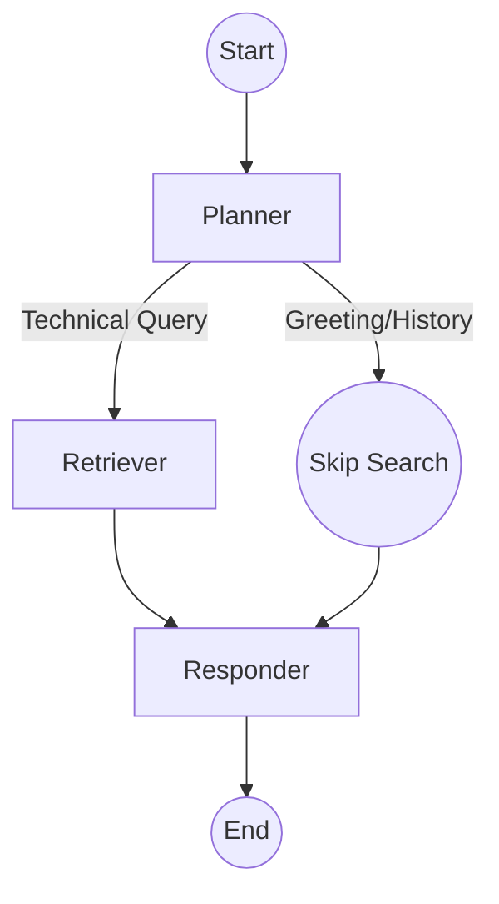

# 🧠 Node Intelligence: The Agentic Brain

The project uses a **Cyclic State Machine** powered by **LangGraph**. Unlike standard RAG, our agent doesn't just search; it *thinks* about whether a search is even necessary.

> This document describes the current nodes. The graph includes MemorySaver, FlashRank reranking, and Portkey routing.

---

## 🤖 The Graph Nodes

### 1. 🧭 The Planner Node
*   **Model**: Portkey-backed `ChatOpenAI` wrapper. Portkey selects the configured model and routing policy.
*   **Logic**: The Planner is the entry point. It analyzes the entire conversation history and the new user message.
*   **Decisions**:
    *   `CONVERSATIONAL`: If the user says "Hi" or asks about something already in the chat history, it skips the expensive search process.
    *   `TECHNICAL`: If the user asks a question about Kubernetes, Intel, or Networking, it generates a refined, optimized search query.

### 2. 🔍 The Retriever Node
*   **Services**: Qdrant Cloud followed by local FlashRank reranking.
*   **Mechanics**:
    *   We convert the user query into a vector using the same local `all-mpnet-base-v2` model used during ingestion.
    *   We perform a **Cosine Similarity** search in Qdrant and retrieve up to **15** candidates.
    *   FlashRank reranks those candidates locally and keeps the top **5** chunks. If reranking fails, the original Qdrant order is used.

### 3. ✍️ The Responder Node
*   **Model**: Groq (Llama 3.3 70B), called directly.
*   **Logic**: This is the final synthesizer. It takes the retrieved documents (if any) and the conversation history to generate a natural, helpful response.
*   **Sources**: It is instructed to use only the provided context. The API currently returns retrieved chunk text, not structured source records with filenames.

---

## ⛓️ Workflow Visualization

---

## 💾 State (no memory checkpoint yet)

The `AgentState` object tracks:
*   `messages`: Conversation messages merged into the LangGraph checkpoint for the supplied `thread_id`.
*   `current_query`: The optimized search term.
*   `documents`: The retrieved technical context.
*   `plan`: A log of "thought steps" displayed in the UI.
