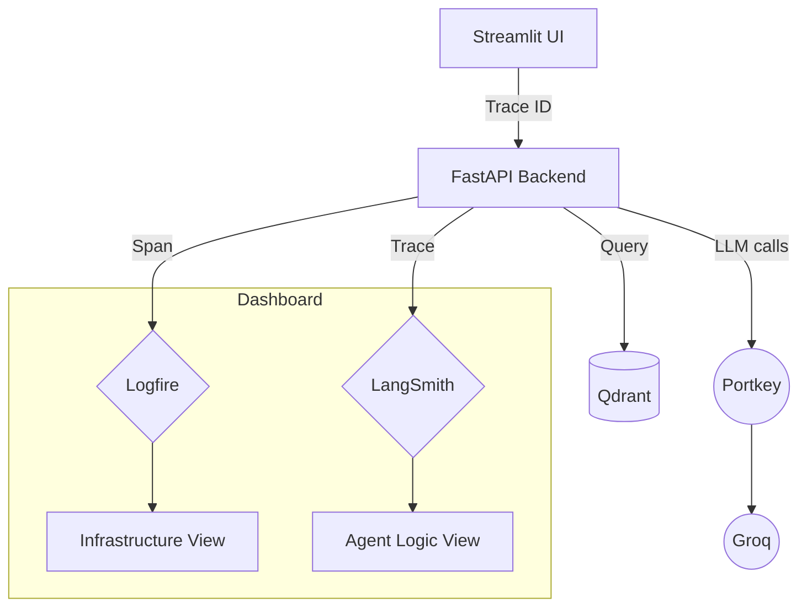

# 🕵️ Tracing & Observability

In an agentic system, tracing shows which gate, graph node, retrieval step, and model call produced a response. This project uses Logfire for application spans and LangSmith's environment-based integration for LangChain/LangGraph runs.

---

## 🔬 The Observability Stack

### 1. Pydantic Logfire (System Tracing)
Logfire provides distributed tracing for the entire infrastructure. It tracks:
*   **API Latency**: How long the backend takes to respond.
*   **Parsing Steps**: Exactly which parser (pypdf, BS4, python-docx) was used for which file.
*   **Database Queries**: Time taken to retrieve results from Qdrant.

### 2. LangSmith (LLM Orchestration)
LangSmith is specialized for the "Agentic" part of the project. It records:
*   **Graph State Transitions**: How the state changed between the Planner and the Retriever.
*   **Prompts and runs**: LangChain/LangGraph calls, including the Portkey-backed planner wrapper.
*   **Token Usage**: Monitoring the cost and efficiency of LLM calls.
*   **Execution state**: Planner routing and graph state transitions. The UI's `thought_process` is an application plan list, not hidden chain-of-thought.

---

## 📊 Tracing Architecture

---

## 🛠️ How to access
*   **Logfire**: Visit your [Logfire Project](https://logfire.pydantic.dev/).
*   **LangSmith**: Visit your [LangSmith Project](https://smith.langchain.com/).

> [!TIP]
> Logfire is configured before application imports in `app/main.py`. This ordering is required because imported modules create spans during initialization. The UI and backend create related spans, but the API does not explicitly return a trace ID.
