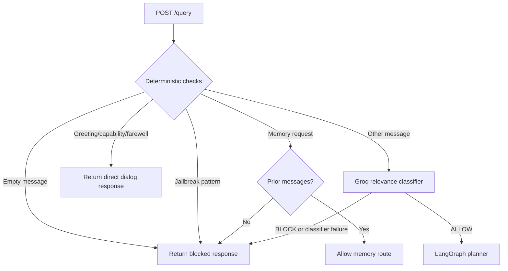

# Input Guardrails and Relevance Gate

The current application uses an input-only gate before LangGraph. The implementation is in `app/guardrails/rails.py` and is called by `app/main.py` before Qdrant retrieval or response generation.

## Runtime Flow



## Deterministic Checks

The gate checks the current message for:

- Empty input
- Jailbreak phrases such as requests to ignore instructions or reveal hidden prompts
- Session-memory questions such as “what did we discuss?”
- Common greetings, capability questions, and farewells

Memory questions are allowed only when the supplied `thread_id` already has prior messages. Greetings and other fixed dialog intents receive a direct response without invoking LangGraph.

## Groq Relevance Classification

Messages that are not handled deterministically are sent to the Groq model configured by `GROQ_GUARD_MODEL`. The classifier receives the current message and a short recent conversation context and must return exactly `ALLOW` or `BLOCK`.

The allowed scope includes Kubernetes, jobs, CronJobs, pods, deployments, autoscaling, Intel hardware, SR-IOV, networking, BGP, VLANs, routing, and related platform engineering topics. Unclear or unrelated requests are blocked.

If the classifier is unavailable or raises an exception, the request is blocked closed rather than sent to retrieval.

## API Behavior

When the gate blocks or handles a request, `/query` returns immediately with:

```json
{
  "answer": "...",
  "thought_process": ["Guardrail: OUT_OF_SCOPE", "Retrieval: Skipped"],
  "status": "Handled by guardrails.",
  "sources": []
}
```

For an allowed request, `main.py` places the classifier result in the initial LangGraph state and invokes the planner.

## What This Implementation Does Not Do

- It does not currently use `LLMRails.generate()` in the request path.
- `colang_rules.py` is retained as policy material but is not the active gate implementation.
- It does not inspect generated answers with a second output guardrail pass.
- It does not implement PII detection or output fact checking.

## Model Separation

The guard classifier uses `GROQ_GUARD_MODEL`, while planner and responder calls go through Portkey. This keeps inexpensive relevance classification separate from answer generation and allows the input gate to fail closed before retrieval.
