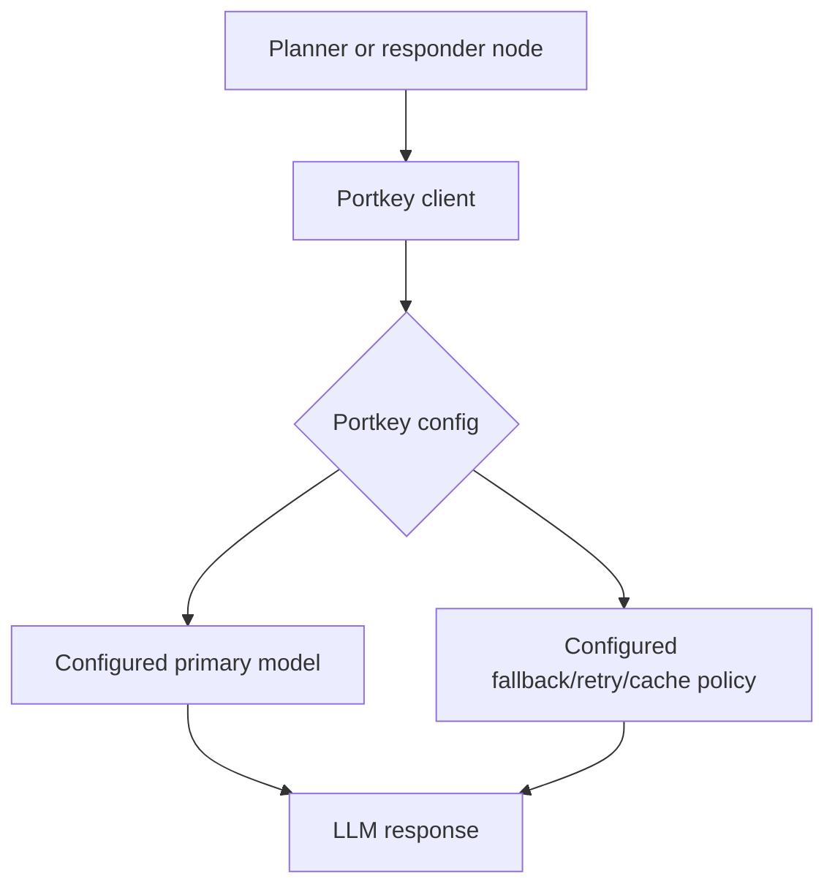
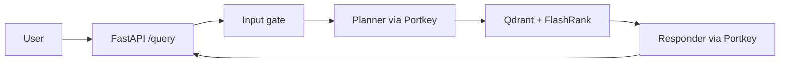

# Portkey LLM Gateway

The application routes planner and responder LLM calls through Portkey. The gateway client is implemented in `app/gateway/client.py`.

## Runtime Flow



The application passes `PORTKEY_CONFIG_ID` to the native `Portkey` client. Routing, fallback, retry, and cache behavior are therefore controlled by the saved Portkey configuration rather than an inline configuration dictionary in this repository.

## Two Client Interfaces

The gateway exposes two clients intentionally:

| Client | Current use | Reason |
|---|---|---|
| `get_langchain_llm()` | `planner.py` | Provides the standard `.invoke()` interface expected by the planner node. |
| `portkey_client` | `responder.py` | The native response exposes the Portkey cache-status header. |

Both clients use the Portkey OpenAI-compatible endpoint and the configured model slug. The planner model is created as `@<PORTKEY_MODEL_SLUG>/openai/gpt-oss-120b` when the slug does not already begin with `@`.

## Responder Cache Status

The responder reads `x-portkey-cache-status` using `extract_cache_status()`. If the SDK response does not expose the header, the helper returns `MISS` as a safe default. A detected `HIT` adds `Cache: Hit` to the returned plan and changes the status to `Cache hit — instant response.`

This UI indicator is best effort. Portkey may still cache a response even when the installed SDK does not expose the header through one of the inspected attributes.

## Required Configuration

```env
PORTKEY_API_KEY="..."
PORTKEY_CONFIG_ID="pc-..."
PORTKEY_MODEL_SLUG="rag"
```

`app/gateway/client.py` validates `PORTKEY_API_KEY` and `PORTKEY_CONFIG_ID` during import. Missing values prevent the application from starting correctly.

The guard classifier is separate: it uses `GROQ_API_KEY` and `GROQ_GUARD_MODEL` directly and does not use the Portkey gateway.

## Query-Level Position

Portkey is not a cache in front of the complete `/query` endpoint. The request still enters FastAPI, runs the input gate, runs the planner, and for technical questions performs retrieval. Portkey caching applies to individual planner or responder LLM calls.



## Observability

Logfire records planner and responder spans, while Portkey provides gateway-level request information according to the configured account and routing setup. The responder logs whether its cache-status header was detected as a hit.
