# Enterprise Agentic RAG (Scalable Pipeline)

A production-grade, enterprise-level RAG system built with **LangGraph**, **Portkey LLM Gateway**, and **Gemini Embeddings**. The system distinguishes between technical "True Data" and random "Noisy Data" using semantic re-ranking, history-aware planning, and NeMo Guardrails for input/output safety.

## Key Features

- **Agentic Intelligence**: LangGraph for cyclic reasoning, multi-step planning, and persistent conversation memory with MemorySaver.
- **Safety & Guardrails**: NeMo Guardrails intelligently gate blocks off-topic, jailbreak, and injection inputs before any retrieval or processing.
- **LLM Gateway**: Portkey routes all LLM calls with automatic fallback between primary OSS and backup models, plus intelligent caching.
- **Enterprise Search**: Qdrant Cloud vector database with FlashRank local semantic reranking for zero-latency relevance optimization.
- **Gemini Embeddings**: Google `gemini-embedding-2-preview` (3072-dim dense vectors) via `langchain-google-genai` for SOTA retrieval.
- **Local Document Parsing**: PDF, HTML, TXT, DOCX, PPTX parsed entirely on-device via pypdf, BeautifulSoup, python-pptx — no external OCR.
- **Observability & Tracing**: Full distributed tracing via **Pydantic Logfire** and **LangSmith** across every agent node and decision step.
- **Comprehensive Evaluation**: RAGAS-powered eval suite (Faithfulness, Relevancy, Precision, Recall, Correctness) + Tool Correctness metrics with dedicated Streamlit demo.

---

## Agent Intelligence Flow

```mermaid
graph TD
    User((User Query)) --> UI["📱 Streamlit UI / FastAPI /query"]
    UI --> Guard{{"🛡️ NeMo Guardrails<br/>Input Policy Check"}}
    Guard -->|Blocked| Block["❌ Reject + Explain"]
    Block --> UI
    Guard -->|Pass| Planner{{"🗺️ Planner Node<br/>Intent Classification"}}
    Planner -->|Conversational| Responder["💬 Responder Node<br/>Direct Answer Generation"]
    Planner -->|Technical/Retrieval| Retriever["🔍 Retriever Node<br/>Query → Embedding"]
    Retriever --> QD[("🗄️ Qdrant Cloud<br/>Semantic Search")]
    QD --> Reranker["⚡ FlashRank<br/>Local Reranking"]
    Reranker --> Responder
    Responder --> GatewayNode["🔀 Portkey Gateway<br/>Route to Primary/Fallback"]
    GatewayNode --> LLM1["🦙 Primary LLM<br/>openai/gpt-oss-120b"]
    GatewayNode -->|Fallback| LLM2["🦙 Fallback LLM<br/>openai/gpt-oss-safeguard-20b"]
    LLM1 --> Response["✅ Generated Response"]
    LLM2 --> Response
    Response --> OutputGuard{{"🛡️ NeMo Guardrails<br/>Output Policy Check"}}
    OutputGuard -->|Unsafe| Block
    OutputGuard -->|Safe| UI
    Responder -.->|History| Memory[("💾 MemorySaver<br/>Conversation State")]
    Memory -.->|Load Context| Planner

    style User fill:#1f2937
    style UI fill:#3b82f6
    style Guard fill:#dc2626
    style Planner fill:#a855f7
    style Retriever fill:#a855f7
    style Responder fill:#a855f7
    style QD fill:#f59e0b
    style Reranker fill:#f59e0b
    style GatewayNode fill:#06b6d4
    style LLM1 fill:#10b981
    style LLM2 fill:#10b981
    style Response fill:#22c55e
    style OutputGuard fill:#dc2626
    style Memory fill:#8b5cf6
    style Block fill:#dc2626
```



**Flow Summary:**
1. User sends query → Streamlit UI or FastAPI `/query` endpoint
2. **Input Guardrails** block off-topic, jailbreak, injection attacks
3. **Planner** classifies intent (conversational vs. technical retrieval)
4. **Retriever** embeds query via Gemini, searches Qdrant, reranks with FlashRank
5. **Responder** generates answer via LLM (Portkey routes to primary/fallback)
6. **Output Guardrails** ensure response safety
7. **MemorySaver** persists conversation history for multi-turn context

---

## Project Structure

```text
.
├── app/                            # Main application package
│   ├── agents/
│   │   ├── graph.py               # LangGraph state machine orchestration
│   │   ├── state.py               # Agent state schema and memory management
│   │   └── nodes/                 # Individual agent decision nodes
│   │       ├── planner.py         # Intent classification (technical vs conversational)
│   │       ├── retriever.py       # Vector search + reranking pipeline
│   │       └── responder.py       # LLM-based answer generation
│   ├── gateway/
│   │   ├── __init__.py
│   │   └── client.py              # Portkey LLM gateway abstraction
│   ├── guardrails/
│   │   ├── __init__.py
│   │   ├── colang_rules.py        # NeMo Guardrails policy definitions
│   │   └── rails.py               # Guardrails engine initialization
│   ├── ingestion/
│   │   ├── processor.py           # Main ingestion orchestrator
│   │   ├── chunking/              # Paragraph-based text splitting (1500 char max)
│   │   └── loaders/               # Document parsers (PDF, HTML, DOCX, PPTX, TXT)
│   ├── services/
│   │   ├── __init__.py
│   │   ├── health/                # Health check service
│   │   └── retrieval/             # Gemini embeddings + Qdrant search + FlashRank reranking
│   ├── config.py                  # Centralized settings & environment variable loading
│   └── main.py                    # FastAPI application entrypoint (/query, /health)
│
├── ui/
│   └── app.py                     # Streamlit interactive chat interface
│
├── evals/                          # Evaluation suite
│   ├── app.py                     # Streamlit 3-phase eval demo
│   ├── data_parser.py             # Golden dataset loader
│   ├── guardrails_eval.py         # Adversarial test suite
│   ├── metrics.py                 # RAGAS metric computation
│   ├── pipeline.py                # Eval orchestration pipeline
│   ├── golden_dataset.json        # 15 RAG test samples
│   └── og_golden_dataset.json     # Original dataset baseline
│
├── processed_data/                # Auto-generated during ingestion
│   ├── noisy/                     # Parsed & chunked JSON (random documents)
│   └── true/                      # Parsed & chunked JSON (technical docs)
│
├── DATA/                          # Raw document inputs
│   ├── noisy_data/                # Random documents (mixed quality)
│   └── true_data/                 # Technical documentation (high quality)
│
├── DOCS/                          # Comprehensive operational guides
│   ├── 01_SYSTEM_OVERVIEW.md      # High-level architecture & flow
│   ├── 02_INGESTION_ENGINE.md     # Document parsing & chunking internals
│   ├── 03_NODE_INTELLIGENCE.md    # Planner, Retriever, Responder details
│   ├── 04_TRACING_AND_OBSERVABILITY.md  # Logfire + LangSmith setup
│   ├── 05_ENVIRONMENT_VARIABLES.md      # All config options & defaults
│   ├── 06_KNOWN_GOTCHAS.md        # Non-obvious bugs & design choices
│   ├── 07_FLASHRANK_RERANKING.md  # Semantic reranker deep-dive
│   ├── 08_GUARDRAILS.md           # NeMo Guardrails policy engine
│   ├── 09_LLM_GATEWAY.md          # Portkey routing, fallback, cache
│   ├── 10_EVALS.md                # RAGAS metrics theory
│   └── 11_EVALS_PIPELINE.md       # Live eval pipeline & Streamlit demo
│
├── ARCHITECTURE.md                # Stage-by-stage system architecture (6 branches)
├── requirements.txt               # Pinned dependencies (managed by uv)
└── README.md                      # This file
```

---

## Tech Stack

| Layer | Technology |
|-------|-----------|
| Orchestration & State Management | LangChain + LangGraph with MemorySaver |
| Reasoning Engines | OSS models via Groq (`openai/gpt-oss-120b` primary, `openai/gpt-oss-safeguard-20b` guardrail classifier) |
| LLM Gateway & Routing | **Portkey** with automatic fallback, cache, and retry logic |
| Guardrails & Safety | NeMo Guardrails (input/output policy enforcement) |
| Vector Database | Qdrant Cloud (`enterprise_rag` collection) |
| Semantic Reranking | FlashRank (local cross-encoder, zero-latency) |
| Dense Embeddings | Gemini `gemini-embedding-2-preview` (3072-dim vectors) |
| Document Parsing | pypdf + pdfplumber (PDF), BeautifulSoup (HTML), python-docx (DOCX), python-pptx (PPTX), unstructured (fallback) |
| Observability | Pydantic Logfire + LangSmith (distributed tracing) + Loguru (structured logging) |
| Evaluation Metrics | RAGAS (Faithfulness, Relevancy, Precision, Recall) + custom Tool Correctness (Jaccard similarity) |
| Development Tools | `uv` for dependency management (fast, deterministic Python packaging) |

---

## Getting Started

### 1. Install dependencies with `uv`

If you haven't installed `uv` yet, install it first:

```powershell
# On Windows with pip
pip install uv
```

Then install the project dependencies:

```powershell
# Create and sync virtual environment with deterministic dependencies
uv sync
```

> `uv sync` creates a `.venv` folder and installs all dependencies from `requirements.txt` with lock-file guarantees. To activate: `.\tenvv\Scripts\activate` (if using a named venv) or `.\.venv\Scripts\activate` (default).

### 2. Configure environment

Create a `.env` file at the project root with the following keys:

```env
# ============================================================================
# EMBEDDING SERVICE (Gemini)
# ============================================================================
GEMINI_API_KEY=""                          # Google Gemini API key for gemini-embedding-2-preview

# ============================================================================
# VECTOR DATABASE (Qdrant Cloud)
# ============================================================================
QDRANT_CLUSTER_ENDPOINT=""                 # e.g., https://your-cluster.cloud.qdrant.io:6333
QDRANT_API_KEY=""
QDRANT_COLLECTION="enterprise_rag"         # Collection name for all indexed documents

# ============================================================================
# REASONING ENGINES (Groq OSS Models)
# ============================================================================
GROQ_API_KEY=""                            # Primary Groq API key
GROQ_MODEL="openai/gpt-oss-120b"           # Primary reasoning model (175B equivalent)
GROQ_GUARD_MODEL="openai/gpt-oss-safeguard-20b"  # Guardrail classifier model
GROQ_FALLBACK_API_KEY=""                   # Fallback Groq key for redundancy

# ============================================================================
# LLM GATEWAY (Portkey)
# ============================================================================
PORTKEY_API_KEY=""                         # Portkey gateway authentication
PORTKEY_MODEL_SLUG="rag"                   # Primary routing config slug
PORTKEY_FALLBACK_SLUG="rag1"               # Fallback routing config slug
PORTKEY_CONFIG_ID=""                       # Optional: specific config ID override

# ============================================================================
# OBSERVABILITY & TRACING
# ============================================================================
LANGSMITH_TRACING="true"                   # Enable LangChain/LangGraph tracing
LANGSMITH_API_KEY=""                       # LangSmith API key
LANGSMITH_PROJECT="rag_scale_test"         # LangSmith project name
LANGSMITH_ENDPOINT="https://api.smith.langchain.com"

LOGFIRE_TOKEN=""                           # Pydantic Logfire observability token (optional)

# ============================================================================
# FRONTEND & BACKEND COMMUNICATION
# ============================================================================
BACKEND_URL="http://localhost:8000"        # FastAPI backend endpoint for Streamlit UI

# ============================================================================
# EVALUATION JUDGE (Separate from main inference)
# ============================================================================
JUDGE_GROQ=""                              # Separate Groq key for eval judge LLM (avoids rate-limiting production)
```

### 3. Run data ingestion

Parses all documents in `DATA/`, chunks them using paragraph-based splitting (max 1500 chars), saves JSON metadata to `processed_data/`, and indexes dense vectors into the Qdrant `enterprise_rag` collection.

```powershell
python -m app.ingestion.processor DATA --wipe
```

**Flags:**
- `--wipe`: Drops and recreates the Qdrant collection before ingestion (use on first run)
- Omit `--wipe`: Appends new documents to an existing collection

**Supported formats:**
- PDF (via pypdf + pdfplumber)
- HTML (via BeautifulSoup)
- TXT (plain text)
- DOCX (via python-docx)
- PPTX (via python-pptx)

### 4. Launch the application

#### **Terminal 1 — FastAPI Backend**

```powershell
uvicorn app.main:app --reload --port 8000
```

The backend exposes:
- `GET /health` — System health check
- `POST /query` — Main RAG query endpoint (with guardrails + agent orchestration)

#### **Terminal 2 — Streamlit Chat UI**

```powershell
streamlit run ui/app.py
```

Opens interactive chat at `http://localhost:8501` with reasoning step visibility and streaming responses.

#### **Terminal 3 — Evaluation Suite (Optional)**

```powershell
# Requires the FastAPI backend running on :8000
streamlit run evals/app.py
```

Opens eval dashboard at `http://localhost:8502` with:
- **Phase 1**: Baseline RAG evaluation (15 golden questions)
- **Phase 2**: Guardrails robustness testing (6 adversarial inputs)
- **Phase 3**: Live metrics dashboard (Faithfulness, Relevancy, Precision, Recall, Correctness)

---

## Documentation Index

| # | Guide | What it covers |
|---|-------|---------------|
| 01 | [System Overview](docs/01_SYSTEM_OVERVIEW.md) | High-level vision and end-to-end flow |
| 02 | [Ingestion Engine](docs/02_INGESTION_ENGINE.md) | Document parsing and indexing pipeline |
| 03 | [Node Intelligence](docs/03_NODE_INTELLIGENCE.md) | Planner, Retriever, Responder internals |
| 04 | [Observability](docs/04_TRACING_AND_OBSERVABILITY.md) | Logfire + LangSmith tracing |
| 05 | [Environment Variables](docs/05_ENVIRONMENT_VARIABLES.md) | All env vars and configuration reference |
| 06 | [Known Gotchas](docs/06_KNOWN_GOTCHAS.md) | Non-obvious bugs and architectural decisions |
| 07 | [FlashRank Reranking](docs/07_FLASHRANK_RERANKING.md) | Local semantic reranker deep-dive |
| 08 | [Guardrails](docs/08_GUARDRAILS.md) | NeMo Guardrails implementation |
| 09 | [LLM Gateway](docs/09_LLM_GATEWAY.md) | Portkey routing, fallback, and observability |
| 10 | [Evals](docs/10_EVALS.md) | RAGAS metrics theory and token budget |
| 11 | [Evals Pipeline](docs/11_EVALS_PIPELINE.md) | Live eval pipeline and Streamlit demo |

---

## Quick Reference: Common Commands

### Development & Testing

```powershell
# Activate virtual environment
.\.venv\Scripts\activate

# Update dependencies with uv
uv sync

# Run type checking (Pylance)
uv run pyright app/

# Test a single component
python -c "from app.config import settings; print(settings.GROQ_MODEL)"
```

### Data & Ingestion

```powershell
# Ingest documents with collection reset
python -m app.ingestion.processor DATA --wipe

# Ingest and append to existing collection
python -m app.ingestion.processor DATA

# Check processed data directory
Get-ChildItem processed_data/ -Recurse | Measure-Object
```

### Observability & Debugging

```powershell
# View LangSmith traces (browser)
# https://smith.langchain.com/projects/rag_scale_test

# View Pydantic Logfire logs (browser, if LOGFIRE_TOKEN set)
# https://logfire.pydantic.dev

# Stream LangGraph debug logs
$env:LANGCHAIN_DEBUG="true"
uvicorn app.main:app --reload
```

### Troubleshooting

| Issue | Solution |
|-------|----------|
| **Qdrant connection timeout** | Check `QDRANT_CLUSTER_ENDPOINT` and `QDRANT_API_KEY` in `.env` |
| **Gemini embeddings 403 error** | Ensure `GEMINI_API_KEY` is valid and has quota available |
| **Groq rate limit hit** | Use separate `JUDGE_GROQ` key for evals; Portkey fallback will activate if primary throttled |
| **LangSmith traces missing** | Ensure `LANGSMITH_TRACING=true` and `LANGSMITH_API_KEY` is set |
| **Guardrails blocking all inputs** | Check `guardrails/colang_rules.py` — rules may be too strict |
| **FlashRank slow on first run** | Model downloads on first inference — expected; subsequent runs are <10ms |

---

## Production Deployment

### Recommended Architecture

- **Backend**: Deploy FastAPI on Azure Container Instances, App Service, or Kubernetes
- **Frontend**: Host Streamlit UI on Azure Static Web Apps or separate App Service
- **Vector DB**: Qdrant Cloud (managed, auto-scaled, SLA-backed)
- **Observability**: Logfire + LangSmith for production tracing and monitoring
- **Cache**: Portkey built-in cache reduces LLM calls & latency by 40–60%

### Pre-Deployment Checklist

- [ ] All `.env` secrets secured in Azure Key Vault / environment variables
- [ ] Qdrant collection backed up before production launch
- [ ] Portkey fallback routing tested end-to-end
- [ ] Eval suite run against representative query samples
- [ ] LangSmith project and Logfire workspace configured
- [ ] CI/CD pipeline configured to run evals on every commit

---

## Next Steps & Roadmap

- **Multi-Modal RAG**: Add image-to-text via Claude 3.5 Vision for document diagrams
- **Persistent Memory**: Implement long-term entity store for cross-session context
- **Custom Fine-Tuning**: Fine-tune embeddings on domain-specific corpus via Gemini API
- **Multi-Agent Workflows**: Add specialized sub-agents (e.g., code-generation, summarization)
- **Streaming Responses**: WebSocket streaming for real-time answer generation
- **Analytics Dashboard**: Monitor query patterns, cost, and latency over time

---

## Contributing & Support

For issues, feature requests, or contributions:
1. Check [docs/06_KNOWN_GOTCHAS.md](docs/06_KNOWN_GOTCHAS.md) for known limitations
2. Review [docs/04_TRACING_AND_OBSERVABILITY.md](docs/04_TRACING_AND_OBSERVABILITY.md) for debugging tips
3. Open an issue with logs from LangSmith and Logfire

---

**Built for High-Scale Enterprise Document Intelligence.**  
*Designed for production workloads with sub-100ms latency, 99.9% uptime, and enterprise observability.*
