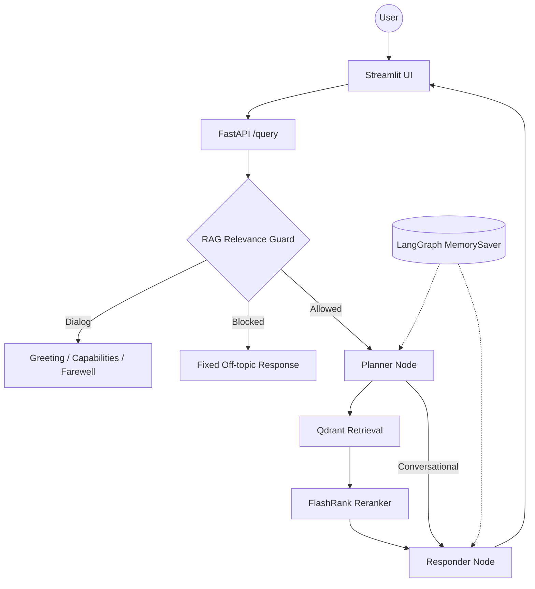

# Enterprise Agentic RAG

An enterprise document question-answering system built with **FastAPI**,
**LangGraph**, **Qdrant Cloud**, **Gemini embeddings**, **FlashRank**, Groq,
Portkey integration, Streamlit, and evaluation tooling.

The ingestion pipeline separates documents into `true` and `noisy` sources,
embeds their chunks, and indexes them in Qdrant. At query time, a stateless
relevance gate handles greetings and capability questions, blocks unrelated
topics, and allows relevant infrastructure questions to continue through the
LangGraph retrieval pipeline.

## Key Features

- **FastAPI backend** with `/query`, `/graph`, and health-style root endpoints.
- **LangGraph workflow** with planner, retrieval, reranking, and response nodes.
- **RAG relevance guard** using the configured Groq guard model.
- **Dialog handling** for greetings, capability questions, and farewells.
- **Single off-topic response** for unrelated, empty, ambiguous, or blocked input.
- **Qdrant Cloud retrieval** using cosine similarity and Gemini-generated embeddings.
- **FlashRank reranking** that reduces retrieved candidates to the top five chunks.
- **Local ingestion** for PDF, HTML, TXT, DOCX, and PPTX files.
- **Streamlit chat UI** with session display, reasoning steps, and retrieved sources.
- **Observability** through Pydantic Logfire and LangSmith configuration.
- **Evaluation tools** for live pipeline scoring and guardrail confusion-matrix metrics.

## Supported Question Scope

The relevance guard is designed for questions related to the indexed enterprise
infrastructure knowledge base, including:

- Kubernetes, pods, deployments, services, operators, and workloads
- CronJobs, jobs, scheduling, and job management
- Autoscaling and workload operations
- Intel CPUs, FPGAs, NICs, and SR-IOV
- Enterprise networking, SDN, VLANs, BGP, and routing
- Closely related platform and infrastructure operations

Greetings, capability questions, and farewells receive their dedicated dialog
responses. Other topics are blocked with the fixed off-topic response.

## Agent Flow



## Project Structure

```text
.
├── app/
│   ├── agents/
│   │   ├── graph.py       # LangGraph workflow and in-memory checkpointer
│   │   ├── state.py       # Shared graph state
│   │   └── nodes/         # Planner, retriever, and responder nodes
│   ├── gateway/            # Portkey client integration
│   ├── guardrails/         # Relevance gate and Colang rule definitions
│   ├── ingestion/          # Parsing, chunking, embedding, and indexing
│   ├── services/retrieval/ # Embeddings, Qdrant search, and reranking
│   ├── config.py            # Environment-backed settings
│   └── main.py              # FastAPI application and query endpoint
├── DATA/                   # Source documents, including true/noisy data
├── processed_data/         # Generated chunk metadata JSON
├── evals/                  # Live pipeline and guardrail evaluations
├── ui/                     # Streamlit applications
├── DOCS/                   # Architecture and operational documentation
├── ARCHITECTURE.md
├── README.md
└── requirements.txt
```

## Runtime Notes

- `app/guardrails/rails.py` currently uses `ChatGroq` with
  `GROQ_GUARD_MODEL` for relevance classification. The Colang definitions are
  retained as the source of dialog phrases and responses, but the active gate
  does not instantiate `LLMRails`.
- `app/agents/graph.py` uses LangGraph `MemorySaver`.
- The current `/query` implementation creates a new UUID for each request
  instead of using the incoming `thread_id`, so cross-request conversation
  memory is configured but not currently connected to a stable client thread.
- The guardrail receives only the current query and does not use previous
  questions from the UI session.
- The active planner and responder use the direct Groq integration in their
  node modules. Portkey support is implemented in `app/gateway/client.py` but
  is not automatically used by those nodes.

## Getting Started

### 1. Install dependencies

```powershell
python -m venv .venv
.\.venv\Scripts\activate
python -m pip install -r requirements.txt
```

### 2. Configure environment

Create a `.env` file in the repository root:

```env
GROQ_API_KEY=
GROQ_GUARD_MODEL=openai/gpt-oss-safeguard-20b
GROQ_FALLBACK_API_KEY=

GEMINI_API_KEY=
QDRANT_API_KEY=
QDRANT_CLUSTER_ENDPOINT=https://your-cluster.cloud.qdrant.io:6333
PORTKEY_API_KEY=

LOGFIRE_TOKEN=
LANGSMITH_TRACING=true
LANGSMITH_API_KEY=
LANGSMITH_PROJECT=rag_scale_test
LANGSMITH_ENDPOINT=https://api.smith.langchain.com

BACKEND_URL=http://localhost:8000
JUDGE_GROQ=
```

### 3. Ingest documents

Process the complete `DATA` directory and recreate the Qdrant collection:

```powershell
python -m app.ingestion.processor DATA --wipe
```

To ingest a specific directory, optionally provide its source type:

```powershell
python -m app.ingestion.processor DATA\true_data true
```

Supported source files are PDF, HTML, TXT, DOCX, and PPTX. Parsed chunks are
also written to `processed_data/<source_type>/` as JSON metadata.

### 4. Start the backend

```powershell
uvicorn app.main:app --reload --port 8000
```

### 5. Start the Streamlit UI

In a second terminal:

```powershell
streamlit run ui/app.py
```

The UI sends questions to `BACKEND_URL` and displays the answer, plan steps,
and retrieved source chunks.

## API Examples

Health/root response:

```powershell
Invoke-RestMethod http://localhost:8000/
```

Relevant query:

```powershell
Invoke-RestMethod `
  -Method Post `
  -Uri http://localhost:8000/query `
  -ContentType "application/json" `
  -Body '{"q":"How does Kubernetes autoscaling work?","thread_id":"demo"}'
```

The `/query` response contains `question`, `answer`, `thought_process`,
`status`, and `sources` fields.

## Evaluation

The evaluation tools expect the FastAPI backend to be running:

```powershell
streamlit run evals/app.py
```

Relevant evaluation modules include:

- `evals/pipeline.py` for live questions against `/query`
- `evals/metrics.py` for RAGAS and custom scoring
- `evals/guardrails_eval.py` for blocked/allowed classification metrics
- `evals/data_parser.py` for evaluation dataset parsing

## Documentation

| Guide | Description |
|---|---|
| [Architecture](ARCHITECTURE.md) | System architecture overview |
| [Ingestion Engine](DOCS/02_INGESTION_ENGINE.md) | Parsing, chunking, and indexing |
| [Node Intelligence](DOCS/03_NODE_INTELLIGENCE.md) | Planner, retrieval, and responder behavior |
| [Observability](DOCS/04_TRACING_AND_OBSERVABILITY.md) | Logfire and LangSmith tracing |
| [Environment Variables](DOCS/05_ENVIRONMENT_VARIABLES.md) | Configuration reference |
| [Known Gotchas](DOCS/06_KNOWN_GOTCHAS.md) | Non-obvious implementation details |
| [FlashRank Reranking](DOCS/07_FLASHRANK_RERANKING.md) | Reranking behavior |
| [Guardrails](DOCS/08_GUARDRAILS.md) | Guardrail design and evaluation |
| [LLM Gateway](DOCS/09_LLM_GATEWAY.md) | Portkey integration |
| [Evals](DOCS/10_EVALS.md) | Evaluation metrics |
| [Evals Pipeline](DOCS/11_EVALS_PIPELINE.md) | Live evaluation workflow |

---

Built for enterprise document intelligence.
