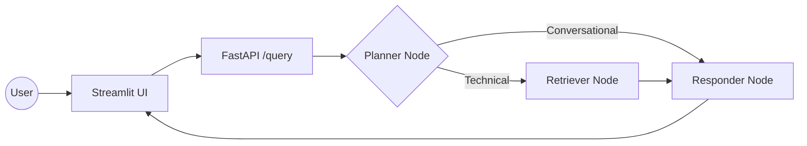

# Enterprise Agentic RAG (Taught in Stages)

This repository is taught **incrementally, one git branch per lesson**. Each
branch is a small, runnable step on top of the previous one.

## Lesson roadmap

| Stage | Branch | What you'll build |
|---|---|---|
| 1 | `stage-1-ingestion` | Parse local documents, chunk them, embed them, and index them into a vector database |
| **2** | **`stage-2-basic-rag`** ← you are here | A minimal FastAPI + LangGraph RAG agent — no reranking, no memory yet |
| 3 | `stage-3-rerank-memory` | Add a local semantic reranker and multi-turn conversation memory |
| 4 | `stage-4-guardrails` | Add an input safety gate that blocks off-topic and jailbreak attempts |
| 5 | `stage-5-llm-gateway` | Route all LLM calls through an LLM gateway with automatic fallback and caching |
| 6 | `stage-6-evals` | Add a RAGAS-based evaluation suite to measure the whole system |

---

## Stage 2 — Basic RAG (no reranking, no memory)

Turns the vector store built in Stage 1 into an answerable agent, served
over a FastAPI `/query` endpoint with a Streamlit chat UI in front of it.



**Deliberately not present yet:**
- No reranking — the Retriever takes Qdrant's raw top-5 results as-is.
- No memory — every `/query` call starts from a blank slate. Ask a
  follow-up like *"what did I just ask?"* and the agent won't know.
- No LLM Gateway — `planner_node`/`generate_node` call `ChatGroq` directly.
- No guardrails — any input reaches the agent.

### Project structure (new this stage)

```text
├── app/
│   ├── agents/
│   │   ├── state.py            # AgentState — shared LangGraph state shape
│   │   ├── graph.py             # StateGraph: planner → retriever/responder
│   │   └── nodes/
│   │       ├── planner.py       # Classifies CONVERSATIONAL vs. technical intent
│   │       ├── retriever.py     # Qdrant search only (no rerank)
│   │       └── responder.py     # Synthesizes the final answer (direct Groq)
│   ├── services/retrieval/
│   │   └── qdrant_service.py    # search_enterprise_knowledge()
│   └── main.py                  # FastAPI entrypoint — /query endpoint
└── ui/
    └── app.py                    # Streamlit chat interface
```

### 1. Install dependencies

```powershell
pip install -r requirements.txt
```

### 2. Configure environment

Add `GROQ_API_KEY` to your `.env` (on top of Stage 1's Gemini/Qdrant vars).

### 3. Launch the app

```powershell
# Terminal 1 — FastAPI backend
uvicorn app.main:app --reload --port 8000

# Terminal 2 — Streamlit UI
streamlit run ui/app.py
```

### Verify it worked

- Ask a technical question — you should get a sourced answer and see
  `GET /graph` render a 3-node PNG (planner → retriever → responder).
- Ask a follow-up that depends on the previous turn — it should **fail to
  recall**. That failure is the expected Stage 2 behavior; memory arrives
  next stage.

Next: check out `stage-3-rerank-memory` to add semantic reranking and
multi-turn conversation memory.
