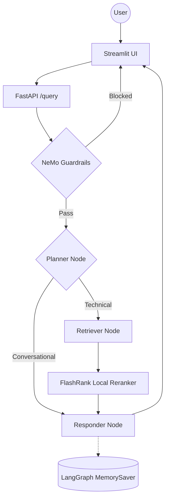

# Enterprise Agentic RAG (Taught in Stages)

This repository is taught **incrementally, one git branch per lesson**. Each
branch is a small, runnable step on top of the previous one.

## Lesson roadmap

| Stage | Branch | What you'll build |
|---|---|---|
| 1 | `stage-1-ingestion` | Parse local documents, chunk them, embed them, and index them into a vector database |
| 2 | `stage-2-basic-rag` | A minimal FastAPI + LangGraph RAG agent — no reranking, no memory yet |
| 3 | `stage-3-rerank-memory` | Add a local semantic reranker and multi-turn conversation memory |
| **4** | **`stage-4-guardrails`** ← you are here | Add an input safety gate that blocks off-topic and jailbreak attempts |
| 5 | `stage-5-llm-gateway` | Route all LLM calls through an LLM gateway with automatic fallback and caching |
| 6 | `stage-6-evals` | Add a RAGAS-based evaluation suite to measure the whole system |

---

## Stage 4 — Guardrails

Adds a **NeMo Guardrails** input gate in front of the agent. Every `/query`
call now checks the raw user message before it ever reaches the LangGraph
pipeline — off-topic questions, jailbreak attempts, greetings, and
capability questions are handled by canned dialog flows instead of being
sent to an LLM at all.



This is **input-only gating** — the guard checks the user's message before
the graph runs; it never inspects the LLM's final answer. The classifier
behind the gate is a fast Groq model (`llama-3.1-8b-instant`), called
directly — it is the one piece of this codebase that never moves onto the
LLM Gateway, even after Stage 5 introduces one for the Planner/Responder.

**Still not present yet:** no LLM Gateway (Planner/Responder still call
`ChatGroq` directly).

### 1. Install dependencies

```powershell
pip install -r requirements.txt
```

### 2. Launch the app

```powershell
uvicorn app.main:app --reload --port 8000
streamlit run ui/app.py
```

### Verify it worked

- Watch the startup logs for guardrails initializing.
- Send an off-topic or jailbreak-style message — the response should have
  `status: "Blocked by guardrails."` and empty `sources`.
- Send a normal technical question — it should flow through the
  Planner/Retriever/Responder pipeline exactly as in Stage 3, unaffected.

Next: check out `stage-5-llm-gateway` to route all LLM calls through a
gateway with automatic fallback and caching.
