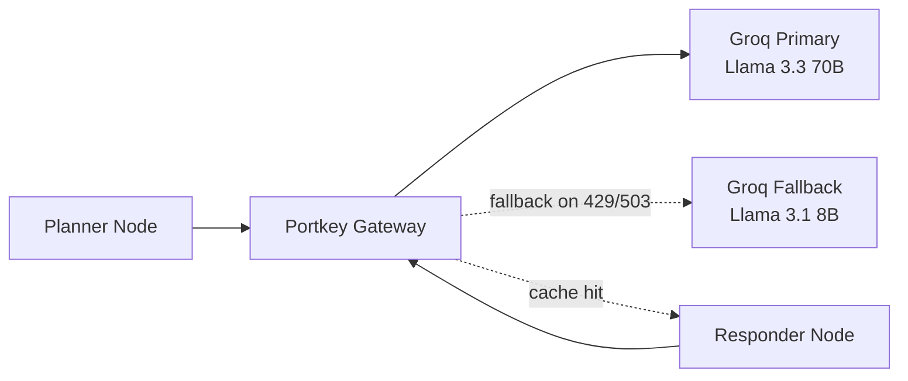

# Enterprise Agentic RAG (Taught in Stages)

This repository is taught **incrementally, one git branch per lesson**. Each
branch is a small, runnable step on top of the previous one.

## Lesson roadmap

| Stage | Branch | What you'll build |
|---|---|---|
| 1 | `stage-1-ingestion` | Parse local documents, chunk them, embed them, and index them into a vector database |
| 2 | `stage-2-basic-rag` | A minimal FastAPI + LangGraph RAG agent — no reranking, no memory yet |
| 3 | `stage-3-rerank-memory` | Add a local semantic reranker and multi-turn conversation memory |
| 4 | `stage-4-guardrails` | Add an input safety gate that blocks off-topic and jailbreak attempts |
| **5** | **`stage-5-llm-gateway`** ← you are here | Route all LLM calls through an LLM gateway with automatic fallback and caching |
| 6 | `stage-6-evals` | Add a RAGAS-based evaluation suite to measure the whole system |

---

## Stage 5 — LLM Gateway

The Planner and Responder nodes stop calling Groq directly and route
through **Portkey** instead — a unified gateway that adds automatic
fallback, response caching, and retry on top of whatever LLM you're
calling.



- **Fallback**: if the primary target (`@rag/llama-3.3-70b-versatile`)
  returns a 429/503 after 2 retries, Portkey automatically retries against
  the fallback target (`@brag/llama-3.1-8b-instant`) — no code change
  needed in the nodes themselves.
- **Caching**: the Responder uses Portkey's native client directly (not the
  LangChain wrapper) specifically so it can read the
  `x-portkey-cache-status` response header and surface `Cache: Hit ⚡` in
  the UI's reasoning trace when a repeated query is served from cache.

**Deliberately NOT migrated to the gateway:** `app/guardrails/rails.py`'s
classifier LLM stays on a direct `ChatGroq` call. The gateway is for the
RAG pipeline's generation calls, not the guardrails gate.

### 1. Install dependencies

```powershell
pip install -r requirements.txt
```

### 2. Configure environment

Add `PORTKEY_API_KEY` and `GROQ_FALLBACK_API_KEY` to your `.env`.

### 3. Launch the app

```powershell
uvicorn app.main:app --reload --port 8000
streamlit run ui/app.py
```

### Verify it worked

- Ask the same question twice — the second call's `thought_process` should
  include `"Cache: Hit ⚡"`.
- Temporarily misconfigure the primary target (e.g. wrong `GROQ_SLUG` in
  `app/config.py`) to see the fallback target fire, then restore it.
- Check your Portkey dashboard — the request should show up there with
  routing/fallback/cache metadata.

Next: check out `stage-6-evals` to add a RAGAS-based evaluation suite.
