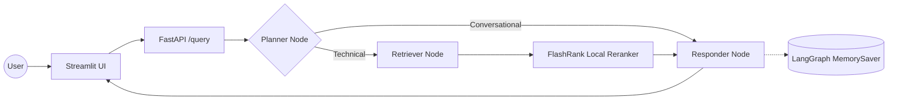

# Enterprise Agentic RAG (Taught in Stages)

This repository is taught **incrementally, one git branch per lesson**. Each
branch is a small, runnable step on top of the previous one.

## Lesson roadmap

| Stage | Branch | What you'll build |
|---|---|---|
| 1 | `stage-1-ingestion` | Parse local documents, chunk them, embed them, and index them into a vector database |
| 2 | `stage-2-basic-rag` | A minimal FastAPI + LangGraph RAG agent — no reranking, no memory yet |
| **3** | **`stage-3-rerank-memory`** ← you are here | Add a local semantic reranker and multi-turn conversation memory |
| 4 | `stage-4-guardrails` | Add an input safety gate that blocks off-topic and jailbreak attempts |
| 5 | `stage-5-llm-gateway` | Route all LLM calls through an LLM gateway with automatic fallback and caching |
| 6 | `stage-6-evals` | Add a RAGAS-based evaluation suite to measure the whole system |

---

## Stage 3 — Reranking + Memory

Two independent upgrades land together this stage:

1. **Semantic reranking** — the Retriever now pulls the top **15** candidates
   from Qdrant (a fast but "semantically fuzzy" bi-encoder search), then
   uses **FlashRank** (a local cross-encoder) to rerank them down to the
   top **5** most relevant chunks. This is also why `DATA/noisy_data/` (58
   distractor documents) is introduced now, not at Stage 1 — it exists to
   prove reranking actually filters irrelevant content out of a noisy index.
2. **Conversation memory** — the graph is compiled with a `MemorySaver`
   checkpointer, keyed by a `thread_id` you pass in every `/query` request.
   Follow-up questions that depend on earlier turns now work.



**Still not present yet:** no LLM Gateway (Planner/Responder still call
`ChatGroq` directly), no guardrails (any input reaches the agent).

### 1. Install dependencies

```powershell
pip install -r requirements.txt
```

### 2. Re-run ingestion (now over all of DATA/, including the noisy set)

```powershell
python -m app.ingestion.processor DATA --wipe
```

### 3. Launch the app

```powershell
uvicorn app.main:app --reload --port 8000
streamlit run ui/app.py
```

### Verify it worked

- `processed_data/noisy/` should now have 58 JSON files alongside
  `processed_data/true/`'s 6.
- Ask a `true_data`-domain question (e.g. about Kubernetes pods autoscaling
  or cronjobs) — the returned `sources` should be exclusively `true_data`-
  sourced, despite `noisy_data` now being in the index. That's reranking
  doing its job.
- Call `/query` twice with the **same** `thread_id` — the second call
  should recall the first. A fresh `thread_id` should have no recollection.

Next: check out `stage-4-guardrails` to add an input safety gate.
